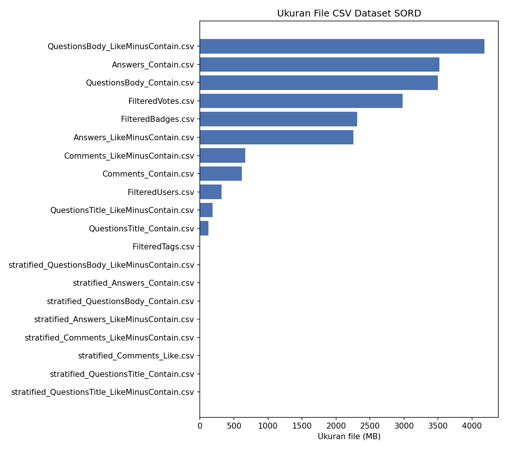
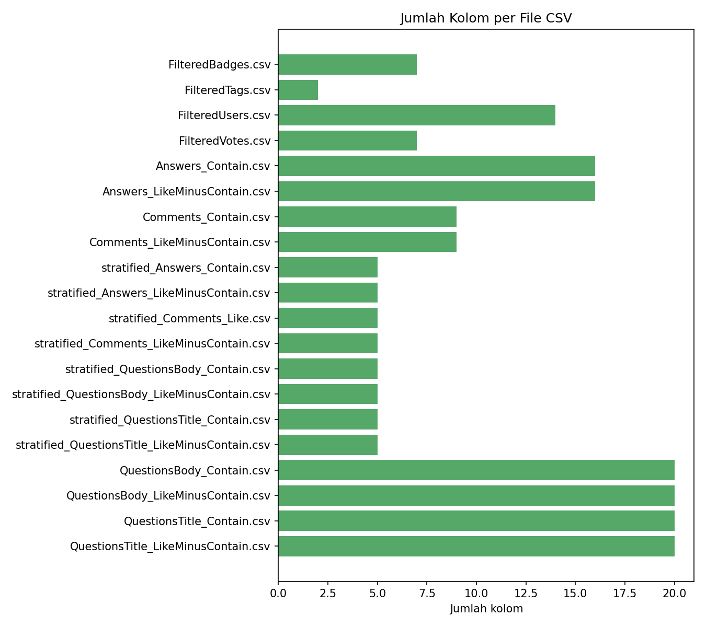

# Preview Dataset SORD

Total file: 20 | Baris preview per file: 5

## Ringkasan Visual Datasource

---

---

## `../00_datasource/raw/additional-metadata/FilteredBadges.csv`

**Ukuran:** 2,313.2 MB

**Jumlah kolom:** 7

**Kolom & tipe data (hasil inferensi dari sample):**

| Kolom | Tipe | Kosong di sample |
| --- | --- | --- |
| AutoIdPK | int64 | 0/5 |
| Id | int64 | 0/5 |
| UserId | int64 | 0/5 |
| Name | object | 0/5 |
| Date | object | 0/5 |
| Class | int64 | 0/5 |
| TagBased | int64 | 0/5 |

**5 baris pertama:**

| AutoIdPK | Id | UserId | Name | Date | Class | TagBased |
| --- | --- | --- | --- | --- | --- | --- |
| 177542 | 20549713 | 6947780 | Teacher | 2016-10-10 13:10:55.933 | 3 | 0 |
| 177546 | 20549833 | 1369547 | Teacher | 2016-10-10 13:19:54.793 | 3 | 0 |
| 177548 | 20549914 | 1364138 | Teacher | 2016-10-10 13:26:00.373 | 3 | 0 |
| 177549 | 20549915 | 2887711 | Teacher | 2016-10-10 13:26:00.373 | 3 | 0 |
| 177553 | 20549919 | 6390949 | Teacher | 2016-10-10 13:26:00.373 | 3 | 0 |

---

## `../00_datasource/raw/additional-metadata/FilteredTags.csv`

**Ukuran:** 1.0 MB

**Jumlah kolom:** 2

**Kolom & tipe data (hasil inferensi dari sample):**

| Kolom | Tipe | Kosong di sample |
| --- | --- | --- |
| Tag | object | 0/5 |
| Count | int64 | 0/5 |

**5 baris pertama:**

| Tag | Count |
| --- | --- |
| .a | 37 |
| .app | 48 |
| .aspxauth | 16 |
| .class-file | 80 |
| .cod-file | 3 |

---

## `../00_datasource/raw/additional-metadata/FilteredUsers.csv`

**Ukuran:** 320.3 MB

**Jumlah kolom:** 14

**Kolom & tipe data (hasil inferensi dari sample):**

| Kolom | Tipe | Kosong di sample |
| --- | --- | --- |
| AutoIdPK | int64 | 0/5 |
| Id | int64 | 0/5 |
| Reputation | int64 | 0/5 |
| CreationDate | object | 0/5 |
| DisplayName | object | 0/5 |
| LastAccessDate | object | 0/5 |
| WebsiteUrl | object | 0/5 |
| Location | object | 0/5 |
| AboutMe | object | 0/5 |
| Views | int64 | 0/5 |
| Upvotes | int64 | 0/5 |
| DownVotes | int64 | 0/5 |
| ProfileImageUrl | float64 | 5/5 |
| AccountId | int64 | 0/5 |

**5 baris pertama:**

| AutoIdPK | Id | Reputation | CreationDate | DisplayName | LastAccessDate | WebsiteUrl | Location | AboutMe | Views | Upvotes | DownVotes | ProfileImageUrl | AccountId |
| --- | --- | --- | --- | --- | --- | --- | --- | --- | --- | --- | --- | --- | --- |
| 22 | 5 | 53255 | 2008-07-31 14:22:31.317 | Jon Galloway | 2025-03-23 02:25:21.437 | http://weblogs.asp.net/jgalloway/ | San Diego, CA | 
Technical Evangelist at Microsoft, specializing in ASP.NET MVC.
  
I don't use this site anymore because the moderators close or delete far too many of the useful questions.
  | 15976 | 758 | 26 |  | 5 |
| 32 | 23 | 7240 | 2008-08-01 12:11:43.703 | Jax | 2025-10-01 14:58:54.363 | 0 | Charlotte, NC, United States | 0 | 1381 | 670 | 10 |  | 16 |
| 38 | 30 | 12079 | 2008-08-01 12:25:44.817 | Grant | 2025-10-01 03:23:23.927 | http://beta.stackoverflow.com/badges/22/great-question | Georgia | 
Lead (and only) programmer for respectable hardware company.
  | 1805 | 148 | 8 |  | 22 |
| 40 | 33 | 30683 | 2008-08-01 12:32:10.963 | John | 2025-10-01 14:17:33.867 | https://www.blueboxes.co.uk | Southampton, United Kingdom | 
I am a Microsoft MVP (Azure) and software developer primarily working with Microsoft technologies and you can find me on <a href="https://twitter.com/johnkilmister" rel="nofollow noreferrer">twitte…[+184 char] | 2494 | 3227 | 28 |  | 24 |
| 47 | 40 | 13107 | 2008-08-01 12:48:12.353 | Kevin | 2024-08-12 20:03:11.333 | http://kevinx.net/ | Philadelphia, PA | 0 | 1545 | 644 | 95 |  | 31 |

---

## `../00_datasource/raw/additional-metadata/FilteredVotes.csv`

**Ukuran:** 2,980.7 MB

**Jumlah kolom:** 7

**Kolom & tipe data (hasil inferensi dari sample):**

| Kolom | Tipe | Kosong di sample |
| --- | --- | --- |
| AutoIdPK | int64 | 0/5 |
| Id | int64 | 0/5 |
| PostId | int64 | 0/5 |
| VoteTypeId | int64 | 0/5 |
| UserId | float64 | 5/5 |
| CreationDate | object | 0/5 |
| BountyAmount | float64 | 5/5 |

**5 baris pertama:**

| AutoIdPK | Id | PostId | VoteTypeId | UserId | CreationDate | BountyAmount |
| --- | --- | --- | --- | --- | --- | --- |
| 629191 | 306348 | 115838 | 2 |  | 2008-09-22 00:00:00.000 |  |
| 629194 | 306351 | 115306 | 2 |  | 2008-09-22 00:00:00.000 |  |
| 629199 | 306356 | 113702 | 2 |  | 2008-09-22 00:00:00.000 |  |
| 629204 | 306361 | 110043 | 2 |  | 2008-09-22 00:00:00.000 |  |
| 629206 | 306363 | 116577 | 2 |  | 2008-09-22 00:00:00.000 |  |

---

## `../00_datasource/raw/answers/Answers_Contain.csv`

**Ukuran:** 3,521.8 MB

**Jumlah kolom:** 16

**Kolom & tipe data (hasil inferensi dari sample):**

| Kolom | Tipe | Kosong di sample |
| --- | --- | --- |
| AutoIdPK | int64 | 0/5 |
| Id | int64 | 0/5 |
| ParentId | int64 | 0/5 |
| CreationDate | object | 0/5 |
| Score | int64 | 0/5 |
| Body | object | 0/5 |
| OwnerUserId | int64 | 0/5 |
| OwnerDisplayName | float64 | 5/5 |
| LastEditorUserId | int64 | 0/5 |
| LastEditorDisplayName | float64 | 5/5 |
| LastEditDate | object | 0/5 |
| LastActivityDate | object | 0/5 |
| CommentCount | int64 | 0/5 |
| ClosedDate | object | 0/5 |
| CommunityOwnedDate | object | 0/5 |
| ContentLicense | object | 0/5 |

**5 baris pertama:**

| AutoIdPK | Id | ParentId | CreationDate | Score | Body | OwnerUserId | OwnerDisplayName | LastEditorUserId | LastEditorDisplayName | LastEditDate | LastActivityDate | CommentCount | ClosedDate | CommunityOwnedDate | ContentLicense |
| --- | --- | --- | --- | --- | --- | --- | --- | --- | --- | --- | --- | --- | --- | --- | --- |
| 9202380 | 11210786 | 11198340 | 2012-06-26 15:31:44.513 | 6 | 
<a href="http://xmlgraphics.apache.org/batik/" rel="noreferrer">Apache Batik</a> is a very good collection of libraries/programs with support for a very large part of the SVG specification. It incl…[+118 char] | 620249 |  | 0 |  | 1970-01-01 00:00:00.000 | 2012-06-26 15:31:44.513 | 2 | 1970-01-01 00:00:00.000 | 1970-01-01 00:00:00.000 | CC BY-SA 3.0 |
| 9202324 | 11210722 | 11210608 | 2012-06-26 15:28:19.457 | 1 | 
This task isn't suitable for an ASP.NET application, which is, by nature, a browser-based request/response paradigm.  For a modem, you need a long-running service to listen.  I'm not sure it's a go…[+1067 char] | 60682 |  | 60682 |  | 2012-06-26 15:34:58.130 | 2012-06-26 15:34:58.130 | 0 | 1970-01-01 00:00:00.000 | 1970-01-01 00:00:00.000 | CC BY-SA 3.0 |
| 9202299 | 11210691 | 11209684 | 2012-06-26 15:26:10.487 | 0 | 
Actually it's a good practice to sort strings like strings and ints as ints.
  
So I suggest you to write various sort functions for data types that could apper in your project, and with…[+215 char] | 468965 |  | 0 |  | 1970-01-01 00:00:00.000 | 2012-06-26 15:26:10.487 | 0 | 1970-01-01 00:00:00.000 | 1970-01-01 00:00:00.000 | CC BY-SA 3.0 |
| 9202279 | 11210666 | 11210618 | 2012-06-26 15:24:53.670 | 8 | 
In the grails-app/conf/BuildConfig.groovy file you can specify the war like this:
  <pre><code>grails.project.war.file = "target/${appName}-${appVersion}.war" </code></pre>  
So…[+165 char] | 261159 |  | 261159 |  | 2012-06-26 16:03:56.537 | 2012-06-26 16:03:56.537 | 2 | 1970-01-01 00:00:00.000 | 1970-01-01 00:00:00.000 | CC BY-SA 3.0 |
| 9202267 | 11210647 | 11207957 | 2012-06-26 15:23:39.753 | 1 | 
It looks like you are using a <code>CategoryPlot</code> which does not support zooing on the domain range
  
The <a href="http://beagle-project.org" rel="nofollow noreferrer">Beagle search engine</a> had code to parse Mork files.  It's not the most memory efficient solution, but it worked and could be a u…[+627 char] | 156 | Joe Shaw | 0 |  | 1970-01-01 00:00:00.000 | 2008-08-22 17:57:14.510 | 0 | 1970-01-01 00:00:00.000 | 1970-01-01 00:00:00.000 | CC BY-SA 2.5 |
| 1693 | 4244 | 4230 | 2008-08-07 01:06:22.687 | 47 | 
DataGrid was an ASP.NET 1.1 control, still supported. GridView arrived in 2.0, made certain tasks simpler added different databinding features:
  
This link has a comparison of DataGrid …[+206 char] | 419 |  | 905671 |  | 2015-12-13 12:24:06.173 | 2015-12-13 12:24:06.173 | 0 | 1970-01-01 00:00:00.000 | 1970-01-01 00:00:00.000 | CC BY-SA 3.0 |
| 6133 | 14036 | 9033 | 2008-08-18 00:10:35.893 | 2 | <blockquote>   
I think if you have to use nullable   types, it's better to use Nullable&lt;.T>   rather than the question mark   notation. It makes it eye-achingly   obvious that mag…[+627 char] | 1677 | Pat | 63550 |  | 2012-02-13 21:58:36.123 | 2012-02-13 21:58:36.123 | 0 | 1970-01-01 00:00:00.000 | 2008-09-19 07:48:12.290 | CC BY-SA 3.0 |
| 10625 | 23412 | 23382 | 2008-08-22 20:33:13.027 | 1 | 
I think Windows' built-in Task Scheduler is the suggested tool for this job.  That requires an outside application.
  | 1490 | Nick | 0 |  | 1970-01-01 00:00:00.000 | 2008-08-22 20:33:13.027 | 0 | 1970-01-01 00:00:00.000 | 1970-01-01 00:00:00.000 | CC BY-SA 2.5 |
| 12047 | 26356 | 26354 | 2008-08-25 16:36:47.657 | 0 | 
Last time I had to print Barcode (despite the printer or framework) I resorted to use a True Type font with the Barcode I needed. (In my case was EAN-13 something), an european barcode.
  …[+217 char] | 2684 | Mart&#237;n Marconcini | 0 |  | 1970-01-01 00:00:00.000 | 2008-08-25 16:36:47.657 | 0 | 1970-01-01 00:00:00.000 | 1970-01-01 00:00:00.000 | CC BY-SA 2.5 |

---

## `../00_datasource/raw/comments/Comments_Contain.csv`

**Ukuran:** 615.3 MB

**Jumlah kolom:** 9

**Kolom & tipe data (hasil inferensi dari sample):**

| Kolom | Tipe | Kosong di sample |
| --- | --- | --- |
| AutoIdPK | int64 | 0/5 |
| Id | int64 | 0/5 |
| PostId | int64 | 0/5 |
| Score | int64 | 0/5 |
| Text | object | 0/5 |
| CreationDate | object | 0/5 |
| UserDisplayName | int64 | 0/5 |
| UserId | int64 | 0/5 |
| ContentLicense | object | 0/5 |

**5 baris pertama:**

| AutoIdPK | Id | PostId | Score | Text | CreationDate | UserDisplayName | UserId | ContentLicense |
| --- | --- | --- | --- | --- | --- | --- | --- | --- |
| 20159 | 60510670 | 8384 | 14 | *For more portable code, use `fseek` + `ftell` as proposed by Derek.*  No.  The [C Standard](http://www.open-std.org/jtc1/sc22/wg14/www/docs/n1256.pdf) specifically states that `fseek()` to `SEEK_END`…[+358 char] | 2016-04-06 10:54:28.377 | 0 | 4756299 | CC BY-SA 3.0 |
| 20270 | 72579 | 90432 | 1 | I'd be one to suggest that _any_ use of 'goto' is discouraged in general -- but that doesn't mean that it isn't useful. | 2008-10-12 09:46:14.400 | 0 | 5897 | CC BY-SA 2.5 |
| 20317 | 2741604 | 9348 | 1 | If the "member" var is only declared and accessed from the .cpp file, it is more private than a private var declared in the .h file. NOT that I recommend this technique. | 2010-04-26 19:03:07.723 | 0 | 44065 | CC BY-SA 2.5 |
| 20322 | 164970 | 9358 | 15 | Just a note. This module is very old (2002) and doesn's support V2 of ID3 tags | 2008-11-28 10:52:18.160 | 0 | 8206 | CC BY-SA 2.5 |
| 20348 | 47989857 | 9380 | 1 | Here is the support issue from MS that explains that IE will refuse all cookies if the host name contains an underscore.  https://support.microsoft.com/en-us/kb/316112/en-us | 2015-04-29 03:36:05.970 | 0 | 57913 | CC BY-SA 3.0 |

---

## `../00_datasource/raw/comments/Comments_LikeMinusContain.csv`

**Ukuran:** 664.9 MB

**Jumlah kolom:** 9

**Kolom & tipe data (hasil inferensi dari sample):**

| Kolom | Tipe | Kosong di sample |
| --- | --- | --- |
| AutoIdPK | int64 | 0/5 |
| Id | int64 | 0/5 |
| PostId | int64 | 0/5 |
| Score | int64 | 0/5 |
| Text | object | 0/5 |
| CreationDate | object | 0/5 |
| UserDisplayName | int64 | 0/5 |
| UserId | int64 | 0/5 |
| ContentLicense | object | 0/5 |

**5 baris pertama:**

| AutoIdPK | Id | PostId | Score | Text | CreationDate | UserDisplayName | UserId | ContentLicense |
| --- | --- | --- | --- | --- | --- | --- | --- | --- |
| 1043808 | 1229399 | 1362269 | 3 | "That compiled code will also be stored in the assembly and reused on subsequent calls."  This is misleading and/or not very clear.  No compiled code is "stored" in an assembly.  I think you may be re…[+390 char] | 2009-09-07 11:58:07.247 | 0 | 5023 | CC BY-SA 2.5 |
| 1043823 | 1152516 | 1318106 | 0 | @Judah:  `SAFEARRAY` is usually the structure needed to pass an array, and it itself referenced by a `Variant`. What I did not find is how to copy an array floats (4 bytes per float) within the `struc…[+75 char] | 2009-08-23 19:17:13.150 | 0 | 6309 | CC BY-SA 2.5 |
| 1043833 | 8244780 | 1318116 | 0 | @Nat.  This directive is supported in D2006.  See my question http://stackoverflow.com/questions/6905395/getting-external-exception-c0000006-in-d2006-app-how-can-i-force-delphi-to-load/6909895#6909895 | 2011-08-03 02:05:45.887 | 0 | 89691 | CC BY-SA 3.0 |
| 1043891 | 1235294 | 1364939 | 0 | I would guess that he has two filters. One for BTS.ReceivePortName == XXX && HisOwn.Promoted.Propoerty == xxx. | 2009-09-08 14:45:29.983 | 0 | 114130 | CC BY-SA 2.5 |
| 1043894 | 7111699 | 1364939 | 0 | Stop, but don't unenlist the send port (using only the BTS.ReceivePortName filter part). Goto your suspended messages and check what is promoted. Although I cannot explain why the property promotion w…[+100 char] | 2011-05-25 17:38:01.687 | 0 | 265097 | CC BY-SA 3.0 |

---

## `../00_datasource/raw/evaluation/stratified_sample_labelled/stratified_Answers_Contain.csv`

**Ukuran:** 0.3 MB

**Jumlah kolom:** 5

**Kolom & tipe data (hasil inferensi dari sample):**

| Kolom | Tipe | Kosong di sample |
| --- | --- | --- |
| autoidpk | int64 | 0/5 |
| id | int64 | 0/5 |
| Body | object | 0/5 |
| keyword | object | 0/5 |
| Label | object | 0/5 |

**5 baris pertama:**

| autoidpk | id | Body | keyword | Label |
| --- | --- | --- | --- | --- |
| 59903522 | 78981034 | 
If you are worried about performance <em>profile your code</em>. We can make <em>guesses</em> about performance, but it is much more reliable to use the available tools to get actual data that can …[+2789 char] | Recommend | T |
| 36282892 | 45956909 | 
I would recommend the JavaScript guide published by Adobe. It contains examples and detailed instructions on what you can and can't include in a pdf (with regards to JavaScript).
  
<…[+816 char] | Recommend | T |
| 55571367 | 72452171 | 
As you are going to escape user input data, I would like to suggest using <a href="https://developer.wordpress.org/reference/functions/sanitize_text_field/" rel="nofollow noreferrer">sanitize_text_…[+369 char] | Recommend | T |
| 35134978 | 44468843 | 
Hopefully, your dates are true dates or can be converted to true dates using the Cdate([date as string]) function. A true date is a number of double type, like 42896.417349537 where the integer is …[+751 char] | Recommend | T |
| 47351770 | 60817520 | 
The "private" clause applies to the lowest schedule (gang, worker, vector) being used on applied loop.  
  
So a "loop gang private(arr.." will have a private array for each gang that is…[+1693 char] | Recommend | T |

---

## `../00_datasource/raw/evaluation/stratified_sample_labelled/stratified_Answers_LikeMinusContain.csv`

**Ukuran:** 0.1 MB

**Jumlah kolom:** 5

**Kolom & tipe data (hasil inferensi dari sample):**

| Kolom | Tipe | Kosong di sample |
| --- | --- | --- |
| autoidpk | int64 | 0/5 |
| id | int64 | 0/5 |
| Body | object | 0/5 |
| keyword | object | 0/5 |
| Label | object | 0/5 |

**5 baris pertama:**

| autoidpk | id | Body | keyword | Label |
| --- | --- | --- | --- | --- |
| 2952780 | 3713836 | 
I would opt for the slightly more complex second design.  It doesn't require too much more effort, and it will ensure that your code still runs smoothly if someone decides to throw a 1000GB file at…[+121 char] | Recommend | T |
| 44922574 | 57540545 | 
It looks like you misspelled <a href="https://v2.vuejs.org/v2/guide/components-slots.html#Scoped-Slots-with-the-slot-scope-Attribute" rel="nofollow noreferrer"><code>slot-scope</code></a> (you inco…[+1114 char] | Recommend | T |
| 53989298 | 70189945 | 
<code>float3</code> in Unity doesn't have a <code>NaN</code> property. You'll either need to establish your own &quot;special value&quot; for this (not recommended) or wrap the function's return ty…[+263 char] | Recommend | T |
| 16081705 | 19810712 | 
From article  <a href="http://docs.oracle.com/javase/tutorial/java/nutsandbolts/datatypes.html" rel="nofollow">http://docs.oracle.com/javase/tutorial/java/nutsandbolts/datatypes.html</a>
 …[+1769 char] | Recommend | T |
| 59046954 | 77613843 | 
<code>TransientTransactionError</code> is considered a possibly temporary and retryable error as mentioned <a href="https://stackoverflow.com/a/52867766/9492730">here</a>. So you may try to retry i…[+632 char] | Recommend | T |

---

## `../00_datasource/raw/evaluation/stratified_sample_labelled/stratified_Comments_Like.csv`

**Ukuran:** 0.0 MB

**Jumlah kolom:** 5

**Kolom & tipe data (hasil inferensi dari sample):**

| Kolom | Tipe | Kosong di sample |
| --- | --- | --- |
| autoidpk | int64 | 0/5 |
| id | int64 | 0/5 |
| Text | object | 0/5 |
| keyword | object | 0/5 |
| Label | object | 0/5 |

**5 baris pertama:**

| autoidpk | id | Text | keyword | Label |
| --- | --- | --- | --- | --- |
| 55458431 | 80022813 | @camickr: Your recommendation would work for a Swing GUI but not for one that is currently 100% AWT as the OP's currently is (despite what his title says). Terrible that some institutions are still te…[+61 char] | Recommend | T |
| 80641422 | 120963155 | First off, there is no guarantee that the OS will run threads on separate cores.  The OS can treat the threads as separate tasks and use round-robin scheduling on them.  I recommend researching your O…[+43 char] | Recommend | T |
| 33330231 | 46605655 | @KonradRudolph: I completely agree. It was just that if you don't have any reason, then you should probably use the vendor recommended toolchain. | Recommend | T |
| 19355449 | 25871879 | To add to Mark's comment, MPI implementations tend to be very complex pieces of software, especially those parts that implement the actual data transfer. The authors usually concentrate on the efficie…[+374 char] | Recommend | T |
| 75881182 | 112781641 | I recommended adding the `case-insensitive` Haskell package make a newtype like `newtype Username = CI Text`. Give this a PersistFieldSql instance with SQL type "citext". This means both your Haskell …[+62 char] | Recommend | T |

---

## `../00_datasource/raw/evaluation/stratified_sample_labelled/stratified_Comments_LikeMinusContain.csv`

**Ukuran:** 0.0 MB

**Jumlah kolom:** 5

**Kolom & tipe data (hasil inferensi dari sample):**

| Kolom | Tipe | Kosong di sample |
| --- | --- | --- |
| autoidpk | int64 | 0/5 |
| id | int64 | 0/5 |
| Text | object | 0/5 |
| keyword | object | 0/5 |
| Label | object | 0/5 |

**5 baris pertama:**

| autoidpk | id | Text | keyword | Label |
| --- | --- | --- | --- | --- |
| 288869 | 908087 | I will second the FlexBox recommendation. It is has a very, umm, flexible styling and UI options. | Recommend | T |
| 86236949 | 130734849 | That isn't a valid content-type I don't think. You can add that for a JSON type, but not for form-url-encoded (as far as I know). But that alsmost certainly isn't the issue though, or if it is, it's o…[+105 char] | Recommend | T |
| 1060357 | 92688623 | `ask for forgiveness not permission`. very good recommendation. Example: preemptive refusal of installer programs are the worst thing programmer can impose on us. E.g.: trying to be all clever and che…[+68 char] | Recommend | T |
| 27832385 | 38274932 | i think this is what @TheLostMind is talking about : http://docs.oracle.com/javase/7/docs/api/java/lang/Thread.html#join%28long%29  it says, " It is recommended that applications not use wait, notify,…[+35 char] | Recommend | T |
| 51238691 | 73703694 | I followed your recommendation and changed all double-fields to Double and took care of the nulls where they possibly could appear and finally I got it to work. Thanks. | Recommend | T |

---

## `../00_datasource/raw/evaluation/stratified_sample_labelled/stratified_QuestionsBody_Contain.csv`

**Ukuran:** 0.3 MB

**Jumlah kolom:** 5

**Kolom & tipe data (hasil inferensi dari sample):**

| Kolom | Tipe | Kosong di sample |
| --- | --- | --- |
| autoidpk | int64 | 0/5 |
| id | int64 | 0/5 |
| Body | object | 0/5 |
| keyword | object | 0/5 |
| Label | object | 0/5 |

**5 baris pertama:**

| autoidpk | id | Body | keyword | Label |
| --- | --- | --- | --- | --- |
| 20209271 | 25101371 | 
I'm new to both amazon ec2 and SSH and have been unsuccessful at connecting to my first instance(s).  No matter what I try and that includes the Amazon Connection guide, the troubleshooting guide a…[+12944 char] | Recommend | F |
| 657544 | 916745 | 
I'm currently working on developing a windows service which will be deployed to all the workstation within the company. The purpose of the service is to collect various statistics and record them i…[+488 char] | Recommend | T |
| 58033655 | 76069357 | 
I'm building an send email function using the Gmail API.
 
I'm trying to send mail using Service Accounts send email.
 
I'm using jwt  instead of OAuth2 authenicate.
 
Error…[+2053 char] | Recommend | T |
| 50059144 | 64590063 | 
I have gone thru numerous solutions here but non of them worked for me. I have set up a simple Cucumber project but when running .feature Scenario I am getting Undefined scenarios error <a href=…[+963 char] | Recommend | T |
| 20894596 | 25991194 | 
I run xampp 3.2.1 on Windows 8.1. I want to use untainted Canvas elements in javascript. But I don't get it run. However I did <a href="http://www.html5rocks.com/en/tutorials/cors/" rel="nofollow">…[+24504 char] | Recommend | F |

---

## `../00_datasource/raw/evaluation/stratified_sample_labelled/stratified_QuestionsBody_LikeMinusContain.csv`

**Ukuran:** 0.3 MB

**Jumlah kolom:** 5

**Kolom & tipe data (hasil inferensi dari sample):**

| Kolom | Tipe | Kosong di sample |
| --- | --- | --- |
| autoidpk | int64 | 0/5 |
| id | int64 | 0/5 |
| Body | object | 0/5 |
| keyword | object | 0/5 |
| Label | object | 0/5 |

**5 baris pertama:**

| autoidpk | id | Body | keyword | Label |
| --- | --- | --- | --- | --- |
| 38118952 | 48423015 | 
I am building a cricket stats alexa skill which requires the <code>playerName</code> to filter out information. I cannot use <code>AMAZON.US_FIRST_NAME</code> because of the following reasons:
<…[+659 char] | Recommend | T |
| 46799593 | 60062870 | 
I need to grab the texture of whatever is drawn to the frame buffer, in other words, whatever is appearing below the effect that i'm about to draw. Use case is to feed this texture to a shader t…[+3008 char] | Recommend | T |
| 47319774 | 60772315 | 
I'm wondering what the best way is to evaluate a fitted binary classification model using Apache Spark 2.4.5 and PySpark (Python). I want to consider different metrics such as accuracy, precision, …[+5763 char] | Recommend | T |
| 27430564 | 34394477 | 
I am getting the following error when running a <code>sudo</code> command on Ubuntu 14 server on EC2/VPC on Amazon Web Services.
  <pre><code>sudo: unable to resolve host ip-xxx-xx-x-xx <b…[+940 char] | Recommend | T |
| 35992139 | 45572272 | 
So I am creating a forum inside my app and when fetching the topics on the database I also need to fetch some user info like picture and username of the original poster to put it on the table view …[+3094 char] | Recommend | T |

---

## `../00_datasource/raw/evaluation/stratified_sample_labelled/stratified_QuestionsTitle_Contain.csv`

**Ukuran:** 0.0 MB

**Jumlah kolom:** 5

**Kolom & tipe data (hasil inferensi dari sample):**

| Kolom | Tipe | Kosong di sample |
| --- | --- | --- |
| autoidpk | int64 | 0/5 |
| id | int64 | 0/5 |
| Title | object | 0/5 |
| keyword | object | 0/5 |
| Label | object | 0/5 |

**5 baris pertama:**

| autoidpk | id | Title | keyword | Label |
| --- | --- | --- | --- | --- |
| 40078730 | 51061922 | Suitable Alternative to div | Suitable | T |
| 9013550 | 10980587 | component one c1upload does fire in callback event so does not support text box ,label values | Support | F |
| 48872521 | 62913770 | TIFF images support in Form Recognizer | Support | F |
| 13935362 | 17096051 | Unable to initialize OData. with Breeze, Needed to support remote OData services | Support | F |
| 52799402 | 68499277 | Heads up! Object-fit: Cover not working in the latest Chrome update, is it a bug or have they dropped support? | Support | F |

---

## `../00_datasource/raw/evaluation/stratified_sample_labelled/stratified_QuestionsTitle_LikeMinusContain.csv`

**Ukuran:** 0.0 MB

**Jumlah kolom:** 5

**Kolom & tipe data (hasil inferensi dari sample):**

| Kolom | Tipe | Kosong di sample |
| --- | --- | --- |
| autoidpk | int64 | 0/5 |
| id | int64 | 0/5 |
| Title | object | 0/5 |
| keyword | object | 0/5 |
| Label | object | 0/5 |

**5 baris pertama:**

| autoidpk | id | Title | keyword | Label |
| --- | --- | --- | --- | --- |
| 34789624 | 44013572 | Recommended code to upload byte[] to Azure file storage | Recommend | T |
| 54515293 | 70937681 | How to hide soft keyboard suggestion for html textarea in IOS WKWebView? | Suggest | F |
| 2843290 | 3583005 | StoredProcedures ... "The Request Properties cannot be supported" | Support | F |
| 34702013 | 43897758 | In App Billing for not supported country | Support | F |
| 19841018 | 24625437 | Found 2 versions of android-support-v7-mediarouter.jar in the dependency list when integration of chromecast | Support | F |

---

## `../00_datasource/raw/questions/QuestionsBody_Contain.csv`

**Ukuran:** 3,501.3 MB

**Jumlah kolom:** 20

**Kolom & tipe data (hasil inferensi dari sample):**

| Kolom | Tipe | Kosong di sample |
| --- | --- | --- |
| AutoIdPK | int64 | 0/5 |
| Id | int64 | 0/5 |
| AcceptedAnswerId | int64 | 0/5 |
| CreationDate | object | 0/5 |
| Score | int64 | 0/5 |
| ViewCount | int64 | 0/5 |
| Body | object | 0/5 |
| OwnerUserId | int64 | 0/5 |
| OwnerDisplayName | float64 | 5/5 |
| LastEditorUserId | int64 | 0/5 |
| LastEditorDisplayName | float64 | 5/5 |
| LastEditDate | object | 0/5 |
| LastActivityDate | object | 0/5 |
| Title | object | 0/5 |
| Tags | object | 0/5 |
| AnswerCount | int64 | 0/5 |
| CommentCount | int64 | 0/5 |
| ClosedDate | object | 0/5 |
| CommunityOwnedDate | object | 0/5 |
| ContentLicense | object | 0/5 |

**5 baris pertama:**

| AutoIdPK | Id | AcceptedAnswerId | CreationDate | Score | ViewCount | Body | OwnerUserId | OwnerDisplayName | LastEditorUserId | LastEditorDisplayName | LastEditDate | LastActivityDate | Title | Tags | AnswerCount | CommentCount | ClosedDate | CommunityOwnedDate | ContentLicense |
| --- | --- | --- | --- | --- | --- | --- | --- | --- | --- | --- | --- | --- | --- | --- | --- | --- | --- | --- | --- |
| 32095542 | 40471301 | 0 | 2016-11-07 17:43:52.097 | 0 | 270 | 
I am getting 
  <blockquote>   
django.db.utils.NotSupportedError: (1235, "This version of MySQL doesn't yet support 'LIMIT &amp; IN/ALL/ANY/SOME subquery'")
 </blockquote> <…[+658 char] | 7046230 |  | 1033581 |  | 2017-12-13 09:46:55.703 | 2017-12-13 09:46:55.703 | Django management command mysql error | <python><mysql><django> | 1 | 1 | 1970-01-01 00:00:00.000 | 1970-01-01 00:00:00.000 | CC BY-SA 3.0 |
| 32095561 | 40471325 | 40471494 | 2016-11-07 17:45:05.417 | 0 | 76 | 
In advance I'm a  begginer for java spring mvc.
  <pre><code>  try{  Connection connection =       DriverManager.getConnection         ("jdbc:mysql://localhost/emidwify?user=ro…[+1225 char] | 6926863 |  | 0 |  | 1970-01-01 00:00:00.000 | 2016-11-07 18:15:05.053 | Suitable driver not found- Spring mvc | <spring-mvc><spring-jdbc> | 1 | 0 | 1970-01-01 00:00:00.000 | 1970-01-01 00:00:00.000 | CC BY-SA 3.0 |
| 32098960 | 40475782 | 0 | 2016-11-07 22:25:20.493 | 0 | 253 | 
I want to store my Oozie Java action class output. I am using plain java code here. Oozie job is running succesfully, but the system.out.println statements are not showing from my Java program.
…[+71 char] | 3716371 |  | 0 |  | 1970-01-01 00:00:00.000 | 2016-11-07 22:25:20.493 | Oozie Java Action output not showing on the console | <java><cloudera><oozie> | 0 | 3 | 1970-01-01 00:00:00.000 | 1970-01-01 00:00:00.000 | CC BY-SA 3.0 |
| 32101183 | 40478740 | 0 | 2016-11-08 04:02:19.300 | 0 | 33 | 
I am currently working on a app in which I integrated a video SDK which has only device support but don't have simulator support, When I am trying to run on simulator it causes error, My question i…[+155 char] | 5505840 |  | 0 |  | 1970-01-01 00:00:00.000 | 2016-11-08 04:18:58.867 | SDK having only device support | <ios><sdk> | 1 | 6 | 1970-01-01 00:00:00.000 | 1970-01-01 00:00:00.000 | CC BY-SA 3.0 |
| 32103980 | 40482449 | 0 | 2016-11-08 08:44:39.563 | 2 | 107 | 
Is it possible create authorization plugin for login screen with BLE support? (not lock screen)
  
Can BLE start in the preLogin mode ? 
  
for example add BLE to this example…[+162 char] | 3787431 |  | 0 |  | 1970-01-01 00:00:00.000 | 2024-09-20 14:21:09.817 | mac os x authorization plugin through bluetooth | <macos><authentication><authorization><bluetooth-lowenergy> | 1 | 0 | 1970-01-01 00:00:00.000 | 1970-01-01 00:00:00.000 | CC BY-SA 3.0 |

---

## `../00_datasource/raw/questions/QuestionsBody_LikeMinusContain.csv`

**Ukuran:** 4,182.0 MB

**Jumlah kolom:** 20

**Kolom & tipe data (hasil inferensi dari sample):**

| Kolom | Tipe | Kosong di sample |
| --- | --- | --- |
| AutoIdPK | int64 | 0/5 |
| Id | int64 | 0/5 |
| AcceptedAnswerId | int64 | 0/5 |
| CreationDate | object | 0/5 |
| Score | int64 | 0/5 |
| ViewCount | int64 | 0/5 |
| Body | object | 0/5 |
| OwnerUserId | int64 | 0/5 |
| OwnerDisplayName | object | 0/5 |
| LastEditorUserId | int64 | 0/5 |
| LastEditorDisplayName | object | 4/5 |
| LastEditDate | object | 0/5 |
| LastActivityDate | object | 0/5 |
| Title | object | 0/5 |
| Tags | object | 0/5 |
| AnswerCount | int64 | 0/5 |
| CommentCount | int64 | 0/5 |
| ClosedDate | object | 0/5 |
| CommunityOwnedDate | object | 0/5 |
| ContentLicense | object | 0/5 |

**5 baris pertama:**

| AutoIdPK | Id | AcceptedAnswerId | CreationDate | Score | ViewCount | Body | OwnerUserId | OwnerDisplayName | LastEditorUserId | LastEditorDisplayName | LastEditDate | LastActivityDate | Title | Tags | AnswerCount | CommentCount | ClosedDate | CommunityOwnedDate | ContentLicense |
| --- | --- | --- | --- | --- | --- | --- | --- | --- | --- | --- | --- | --- | --- | --- | --- | --- | --- | --- | --- |
| 24656 | 48176 | 0 | 2008-09-07 05:21:42.197 | 5 | 1887 | 
You can embed the <a href="http://ipython.scipy.org/" rel="noreferrer">IPython</a> shell inside of your application so that it launches the shell in the foreground.  Is there a way to embed a telne…[+334 char] | 4883 | Tim | 0 |  | 1970-01-01 00:00:00.000 | 2009-11-19 17:10:32.110 | Embedding a remote Python shell in an application | <python><network-programming> | 4 | 0 | 1970-01-01 00:00:00.000 | 1970-01-01 00:00:00.000 | CC BY-SA 2.5 |
| 55231 | 98722 | 98862 | 2008-09-19 01:42:13.683 | 1 | 829 | 
What's the best way to enumerate a set of files and folders using FinalBuilder?
  
The context of my question is, I want to compare a source folder with a destination folder, and replace…[+123 char] | 5007 | Scott Ferguson | 0 |  | 1970-01-01 00:00:00.000 | 2008-09-24 22:55:56.283 | FinalBuilder Enumeration of files and folders | <finalbuilder> | 1 | 0 | 1970-01-01 00:00:00.000 | 1970-01-01 00:00:00.000 | CC BY-SA 2.5 |
| 55383 | 99012 | 0 | 2008-09-19 02:36:46.203 | 0 | 91 | 
When creating a plugin that executes in the default life-cycle, it's easy to obtain a reference to the project and its resources, but I'm getting a null instead of a MavenProject object when creati…[+101 char] | 17008 | Steve Moyer | 123582 |  | 2009-07-30 20:55:41.583 | 2009-07-30 20:55:41.583 | What is the best way to obtain a list of site resources when writing a Maven2 site plugin? | <java><maven-2><maven-plugin> | 1 | 0 | 1970-01-01 00:00:00.000 | 1970-01-01 00:00:00.000 | CC BY-SA 2.5 |
| 56394 | 100747 | 0 | 2008-09-19 09:32:26.673 | 0 | 662 | 
I'm looking for a good way to represent organic growth - especially trees and flowers - using code.
  
I've found Lindenmayer Systems as a reasonable way to portray this, but need a good…[+77 char] | 9961 | eMilk | 3043 |  | 2011-12-07 19:29:38.440 | 2011-12-07 19:29:38.440 | Organic growth with Lindenmayer Systems | <algorithm> | 3 | 0 | 1970-01-01 00:00:00.000 | 1970-01-01 00:00:00.000 | CC BY-SA 2.5 |
| 18271 | 37396 | 37415 | 2008-09-01 02:44:04.170 | 4 | 6056 | 
I want to build a lightweight linux configuration to use for development. The first idea is to use it inside a Virtual Machine under Windows, or old Laptops with 1Gb RAM top. Maybe even a distribut…[+2585 char] | 2274 | Fernando Barrocal | -1 | Fernando Barrocal | 2017-05-23 10:32:50.377 | 2018-04-05 10:50:36.463 | Linux Lightweight Distro and X Windows for Development | <linux><desktop> | 12 | 0 | 2018-04-05 12:26:03.587 | 1970-01-01 00:00:00.000 | CC BY-SA 2.5 |

---

## `../00_datasource/raw/questions/QuestionsTitle_Contain.csv`

**Ukuran:** 124.7 MB

**Jumlah kolom:** 20

**Kolom & tipe data (hasil inferensi dari sample):**

| Kolom | Tipe | Kosong di sample |
| --- | --- | --- |
| AutoIdPK | int64 | 0/5 |
| Id | int64 | 0/5 |
| AcceptedAnswerId | int64 | 0/5 |
| CreationDate | object | 0/5 |
| Score | int64 | 0/5 |
| ViewCount | int64 | 0/5 |
| Body | object | 0/5 |
| OwnerUserId | int64 | 0/5 |
| OwnerDisplayName | float64 | 5/5 |
| LastEditorUserId | int64 | 0/5 |
| LastEditorDisplayName | float64 | 5/5 |
| LastEditDate | object | 0/5 |
| LastActivityDate | object | 0/5 |
| Title | object | 0/5 |
| Tags | object | 0/5 |
| AnswerCount | int64 | 0/5 |
| CommentCount | int64 | 0/5 |
| ClosedDate | object | 0/5 |
| CommunityOwnedDate | object | 0/5 |
| ContentLicense | object | 0/5 |

**5 baris pertama:**

| AutoIdPK | Id | AcceptedAnswerId | CreationDate | Score | ViewCount | Body | OwnerUserId | OwnerDisplayName | LastEditorUserId | LastEditorDisplayName | LastEditDate | LastActivityDate | Title | Tags | AnswerCount | CommentCount | ClosedDate | CommunityOwnedDate | ContentLicense |
| --- | --- | --- | --- | --- | --- | --- | --- | --- | --- | --- | --- | --- | --- | --- | --- | --- | --- | --- | --- |
| 22349238 | 27887974 | 0 | 2015-01-11 14:07:24.420 | 0 | 72 | 
I need something like the <code>ViewPager</code> class.  Must I use the V4 support library or is there an alternative non-support library equivalent to ViewPager?
  | 3594510 |  | 3682067 |  | 2015-01-11 14:29:30.450 | 2015-01-11 14:29:30.450 | Must I use the v4 Support Library for minimum SDK 14 to get ViewPager-like operation? | <android><android-viewpager> | 0 | 2 | 1970-01-01 00:00:00.000 | 1970-01-01 00:00:00.000 | CC BY-SA 3.0 |
| 22347373 | 27885511 | 27885591 | 2015-01-11 09:07:08.200 | -2 | 36 | <pre><code>class sample {        int varOne, varTwo;         sample(int varOne, int varTwo)     {       this.varOne= varOne;       this.varTwo= varTwo;     } } </code></pre>…[+310 char] | 3041193 |  | 447156 |  | 2015-01-11 09:07:49.313 | 2015-01-11 09:22:33.863 | Can someone please suggest a better naming scheme when class variables are same as formal parameters received by a constructor in c# | <c#> | 1 | 2 | 2015-01-11 09:26:24.790 | 1970-01-01 00:00:00.000 | CC BY-SA 3.0 |
| 22345098 | 27882501 | 27882692 | 2015-01-11 00:00:21.820 | 5 | 3588 | 
I have an existing WCF service with a SOAP endpoint, using .NET 4.5. Most of the existing client code is using the <code>ChannelFactory&lt;T&gt;</code> proxy approach.
  
I'd like to cha…[+522 char] | 211378 |  | 0 |  | 1970-01-01 00:00:00.000 | 2015-01-11 00:44:15.137 | How to add async support to a .NET 4.5 WCF service so it doesn't disrupt existing clients? | <.net><wcf><asynchronous><async-await><channelfactory> | 1 | 2 | 1970-01-01 00:00:00.000 | 1970-01-01 00:00:00.000 | CC BY-SA 3.0 |
| 22342899 | 27879601 | 27879651 | 2015-01-10 18:20:07.140 | 0 | 1001 | 
I have one EditText field that I want to stylize as a Spinner, and Im using the support library to Android Lollipop. However, I'm not able to give the correct color to the dropdown selector (the sa…[+1393 char] | 1277555 |  | 1277555 |  | 2015-01-10 18:41:58.393 | 2015-01-10 19:50:52.223 | How can I style my editText as a spinner? Support to Lollipop not working | <android><android-spinner><android-5.0-lollipop><android-support-library> | 1 | 4 | 1970-01-01 00:00:00.000 | 1970-01-01 00:00:00.000 | CC BY-SA 3.0 |
| 22345849 | 27883500 | 0 | 2015-01-11 02:50:44.017 | 1 | 235 | 
When I used <code>@RequiresPermissions</code> I got cannot resolve symbol 'RequiresPermissions' error. I already have imported <code>org.apache.shiro.authz.annotation.RequiresPermissions</code>.<br…[+3040 char] | 4436044 |  | 160313 |  | 2015-01-11 19:12:02.143 | 2015-01-11 19:12:02.143 | shiro annotation is not working in grails. Can anybody suggest me what is wrong? | <grails><shiro> | 1 | 1 | 1970-01-01 00:00:00.000 | 1970-01-01 00:00:00.000 | CC BY-SA 3.0 |

---

## `../00_datasource/raw/questions/QuestionsTitle_LikeMinusContain.csv`

**Ukuran:** 187.6 MB

**Jumlah kolom:** 20

**Kolom & tipe data (hasil inferensi dari sample):**

| Kolom | Tipe | Kosong di sample |
| --- | --- | --- |
| AutoIdPK | int64 | 0/5 |
| Id | int64 | 0/5 |
| AcceptedAnswerId | int64 | 0/5 |
| CreationDate | object | 0/5 |
| Score | int64 | 0/5 |
| ViewCount | int64 | 0/5 |
| Body | object | 0/5 |
| OwnerUserId | int64 | 0/5 |
| OwnerDisplayName | object | 1/5 |
| LastEditorUserId | int64 | 0/5 |
| LastEditorDisplayName | object | 2/5 |
| LastEditDate | object | 0/5 |
| LastActivityDate | object | 0/5 |
| Title | object | 0/5 |
| Tags | object | 0/5 |
| AnswerCount | int64 | 0/5 |
| CommentCount | int64 | 0/5 |
| ClosedDate | object | 0/5 |
| CommunityOwnedDate | object | 0/5 |
| ContentLicense | object | 0/5 |

**5 baris pertama:**

| AutoIdPK | Id | AcceptedAnswerId | CreationDate | Score | ViewCount | Body | OwnerUserId | OwnerDisplayName | LastEditorUserId | LastEditorDisplayName | LastEditDate | LastActivityDate | Title | Tags | AnswerCount | CommentCount | ClosedDate | CommunityOwnedDate | ContentLicense |
| --- | --- | --- | --- | --- | --- | --- | --- | --- | --- | --- | --- | --- | --- | --- | --- | --- | --- | --- | --- |
| 1473 | 3667 | 29213 | 2008-08-06 16:48:24.127 | 15 | 3348 | 
We are currently using a somewhat complicated deployment setup that involves a remote SVN server, 3 SVN branches for DEV, STAGE, and PROD, promoting code between them through patches, etc. I wonder…[+70 char] | 556 |  | 1821 | Graeme Perrow | 2009-01-28 15:06:36.250 | 2017-10-10 23:21:30.080 | What is your favorite web app deployment workflow with SVN? | <svn><deployment> | 11 | 0 | 1970-01-01 00:00:00.000 | 1970-01-01 00:00:00.000 | CC BY-SA 2.5 |
| 3736 | 8952 | 8960 | 2008-08-12 15:20:25.637 | 94 | 162570 | 
Generally, how bad of a performance hit is storing a file in a database (specifically mssql) as opposed to the file system?  I can't come up with a reason outside of application portability that I …[+66 char] | 565 | Cade Cannon | 55 | Ryan Fox | 2008-08-17 01:52:20.633 | 2023-02-20 21:23:01.767 | Storing a file in a database as opposed to the file system? | <sql-server><database><filesystems><storage> | 11 | 0 | 2024-04-16 16:35:20.997 | 1970-01-01 00:00:00.000 | CC BY-SA 2.5 |
| 4305 | 10158 | 0 | 2008-08-13 18:18:30.643 | 3 | 461 | 
What's the easiest way to do an "instring" type function with a regex? For example, how could I reject a whole string because of the presence of a single character such as <code>:</code>? For examp…[+513 char] | 64 | David in Dakota | 592746 |  | 2011-12-20 18:56:46.163 | 2016-02-07 18:31:53.023 | Regex Rejecting matches because of Instr | <regex><xpath> | 5 | 0 | 1970-01-01 00:00:00.000 | 1970-01-01 00:00:00.000 | CC BY-SA 3.0 |
| 4973 | 11612 | 11646 | 2008-08-14 19:51:52.010 | 6 | 449 | 
I want to consolidate all the loose information of the company I work for into a knowledge base. A wiki seems to be the way to go, but most of the relevant information is buried inside PST files, a…[+826 char] | 1014 | Leonardo | 1477076 |  | 2012-08-11 15:43:23.870 | 2012-08-11 15:43:23.870 | Is there any wiki engine that supports page creation by email? | <email><wiki><mime><wiki-engine> | 2 | 0 | 1970-01-01 00:00:00.000 | 1970-01-01 00:00:00.000 | CC BY-SA 3.0 |
| 335130 | 504493 | 0 | 2009-02-02 19:15:22.213 | 2 | 190 | 
Do you have any suggestions or examples on how to deploy minimized (min) versions of JavaScript files using NAnt?
  
Are there any good command line applications, or scripts to assist wi…[+55 char] | 8509 | IanL | 8509 | IanL | 2009-02-02 19:35:22.703 | 2009-02-02 19:40:10.510 | Suggestions on creating & deploying minimized JavaScript with NAnt? | <javascript><nant><packing><minimized> | 2 | 0 | 1970-01-01 00:00:00.000 | 2009-02-02 19:15:22.183 | CC BY-SA 2.5 |

---
