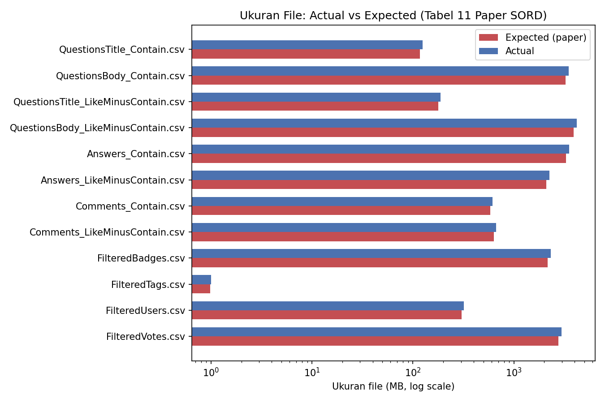
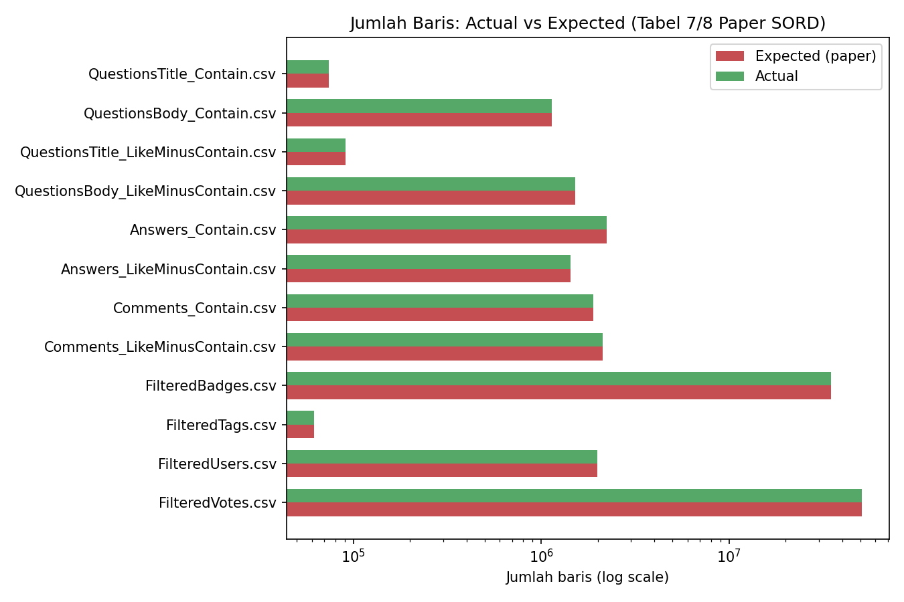
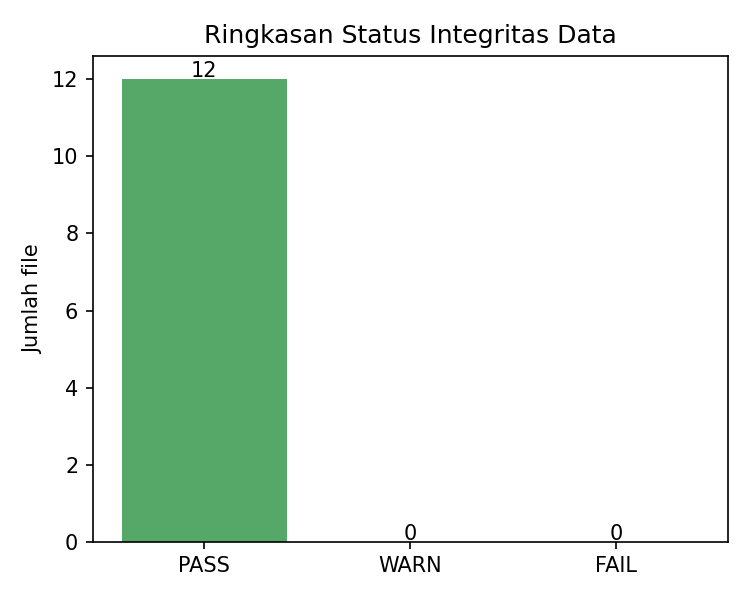

# Laporan Integritas Data SORD

Total file dicek: 12 | FAIL: 0 | WARN: 0 | PASS: 12

**Tindakan:** Semua file lolos cek integritas dasar. Lanjut ke Fase 0.2 (keputusan Contain vs LikeMinusContain, sampling).

## Cara Membaca Laporan Ini

Tabel **Ringkasan Status per File** di bawah berisi kolom:

| Kolom | Isi |
| --- | --- |
| `File` | Path file CSV mentah SORD relatif terhadap `--data-dir` (mis. `questions/QuestionsTitle_Contain.csv`) |
| `Status` | Hasil cek keseluruhan untuk file tsb: `PASS`, `WARN`, atau `FAIL` (lihat definisi di bawah) |

**Definisi status:**

- **PASS** -- file ditemukan, ukuran & jumlah baris sesuai referensi paper SORD (toleransi ukuran 15%, toleransi jumlah baris 1%), kolom minimal lengkap, tidak ada duplikat Id pada sample.
- **WARN** -- file ditemukan & bisa diproses, tapi ada SATU ATAU LEBIH dari: selisih ukuran/jumlah baris di luar toleransi, kolom minimal hilang, ada baris bermasalah (quoting/newline tidak standar), atau ada duplikat Id. Biasanya masih aman dipakai, tapi sebaiknya dicek manual kalau selisih >5%.
- **FAIL** -- file tidak ditemukan, tidak bisa diparse sama sekali, atau permission denied saat membaca. Perlu diunduh/diekstrak ulang sebelum lanjut ke Fase 0.2.

**Detail per file** (di bagian bawah laporan) merinci masing-masing pengecekan yang berkontribusi ke status di atas: ukuran file (actual vs expected dari Tabel 11 paper SORD), jumlah baris (actual vs expected dari Tabel 7/8 paper SORD, dilewati kalau `--quick`), kelengkapan kolom minimal, dan jumlah duplikat Id pada sample (maks. 500.000 baris pertama).

## Ringkasan Visual

## Ringkasan Status per File

| File | Status |
| --- | --- |
| `questions/QuestionsTitle_Contain.csv` | PASS  |
| `questions/QuestionsBody_Contain.csv` | PASS  |
| `questions/QuestionsTitle_LikeMinusContain.csv` | PASS  |
| `questions/QuestionsBody_LikeMinusContain.csv` | PASS  |
| `answers/Answers_Contain.csv` | PASS  |
| `answers/Answers_LikeMinusContain.csv` | PASS  |
| `comments/Comments_Contain.csv` | PASS  |
| `comments/Comments_LikeMinusContain.csv` | PASS  |
| `additional-metadata/FilteredBadges.csv` | PASS  |
| `additional-metadata/FilteredTags.csv` | PASS  |
| `additional-metadata/FilteredUsers.csv` | PASS  |
| `additional-metadata/FilteredVotes.csv` | PASS  |

## Detail per File

### `questions/QuestionsTitle_Contain.csv`
**Status keseluruhan: PASS**

- Ukuran: OK -- size actual=124.7MB expected=118.0MB (selisih 5.7%)
- Baris: OK -- actual=73,901, expected=73,901 (selisih 0.00%)
- Kolom minimal: OK, lengkap
- Duplikat Id (sample): OK -- 0 duplikat

### `questions/QuestionsBody_Contain.csv`
**Status keseluruhan: PASS**

- Ukuran: OK -- size actual=3,501.3MB expected=3,260.0MB (selisih 7.4%)
- Baris: OK -- actual=1,135,148, expected=1,135,148 (selisih 0.00%)
- Kolom minimal: OK, lengkap
- Duplikat Id (sample): OK -- 0 duplikat

### `questions/QuestionsTitle_LikeMinusContain.csv`
**Status keseluruhan: PASS**

- Ukuran: OK -- size actual=187.6MB expected=178.0MB (selisih 5.4%)
- Baris: OK -- actual=90,685, expected=90,685 (selisih 0.00%)
- Kolom minimal: OK, lengkap
- Duplikat Id (sample): OK -- 0 duplikat

### `questions/QuestionsBody_LikeMinusContain.csv`
**Status keseluruhan: PASS**

- Ukuran: OK -- size actual=4,182.0MB expected=3,890.0MB (selisih 7.5%)
- Baris: OK -- actual=1,511,800, expected=1,511,800 (selisih 0.00%)
- Kolom minimal: OK, lengkap
- Duplikat Id (sample): OK -- 0 duplikat

### `answers/Answers_Contain.csv`
**Status keseluruhan: PASS**

- Ukuran: OK -- size actual=3,521.8MB expected=3,270.0MB (selisih 7.7%)
- Baris: OK -- actual=2,228,118, expected=2,228,118 (selisih 0.00%)
- Kolom minimal: OK, lengkap
- Duplikat Id (sample): OK -- 0 duplikat

### `answers/Answers_LikeMinusContain.csv`
**Status keseluruhan: PASS**

- Ukuran: OK -- size actual=2,257.5MB expected=2,100.0MB (selisih 7.5%)
- Baris: OK -- actual=1,427,770, expected=1,427,770 (selisih 0.00%)
- Kolom minimal: OK, lengkap
- Duplikat Id (sample): OK -- 0 duplikat

### `comments/Comments_Contain.csv`
**Status keseluruhan: PASS**

- Ukuran: OK -- size actual=615.3MB expected=586.0MB (selisih 5.0%)
- Baris: OK -- actual=1,900,242, expected=1,900,242 (selisih 0.00%)
- Kolom minimal: OK, lengkap
- Duplikat Id (sample): OK -- 0 duplikat

### `comments/Comments_LikeMinusContain.csv`
**Status keseluruhan: PASS**

- Ukuran: OK -- size actual=664.9MB expected=634.0MB (selisih 4.9%)
- Baris: OK -- actual=2,114,468, expected=2,114,468 (selisih 0.00%)
- Kolom minimal: OK, lengkap
- Duplikat Id (sample): OK -- 0 duplikat

### `additional-metadata/FilteredBadges.csv`
**Status keseluruhan: PASS**

- Ukuran: OK -- size actual=2,313.2MB expected=2,150.0MB (selisih 7.6%)
- Baris: OK -- actual=34,830,450, expected=34,830,450 (selisih 0.00%)
- Duplikat Id (sample): OK -- 0 duplikat

### `additional-metadata/FilteredTags.csv`
**Status keseluruhan: PASS**

- Ukuran: OK -- size actual=1.0MB expected=1.0MB (selisih 2.5%)
- Baris: OK -- actual=61,672, expected=61,672 (selisih 0.00%)

### `additional-metadata/FilteredUsers.csv`
**Status keseluruhan: PASS**

- Ukuran: OK -- size actual=320.3MB expected=305.0MB (selisih 5.0%)
- Baris: OK -- actual=1,993,211, expected=1,993,211 (selisih 0.00%)
- Duplikat Id (sample): OK -- 0 duplikat

### `additional-metadata/FilteredVotes.csv`
**Status keseluruhan: PASS**

- Ukuran: OK -- size actual=2,980.7MB expected=2,770.0MB (selisih 7.6%)
- Baris: OK -- actual=50,725,814, expected=50,725,814 (selisih 0.00%)
- Duplikat Id (sample): OK -- 0 duplikat
