# Laporan EDA Datasource SORD -- Sinyal Kepercayaan & Karakteristik Data

Total chart berhasil: 19 | dilewati (file/kolom tidak tersedia): 0

## Ringkasan: Chart Ini Berisi Apa, Untuk Apa, Dipakai Untuk Apa

| ID | Chart | Sumber Data | Tujuan Analisis | Kegunaan di Tesis | Status |
| --- | --- | --- | --- | --- | --- |
| A1 | Pertanyaan dgn vs tanpa Accepted Answer | questions_raw_union.parquet (AcceptedAnswerId) | Mengukur proporsi pertanyaan yang punya ground truth (accepted answer). | Dasar kuantitatif kriteria inklusi Kondisi A/B/C (Bab III) & ukuran populasi awal sebelum sampling. | OK |
| A2 | Rasio Match Question->Answer | questions + answers parquet (join AcceptedAnswerId -> Answers.Id) | Validasi rasio match setelah fix bug semi-join (filter sebelum sampling). | Bukti empiris justifikasi keputusan implementasi pipeline -- masuk lampiran/catatan metodologi. | OK |
| A3 | Distribusi match_source | kolom match_source di questions/answers/comments parquet | Transparansi proporsi baris asal Contain vs LikeMinusContain. | Mendukung deskripsi karakteristik sumber data di Bab III. | OK |
| A4 | Distribusi Panjang Token Pertanyaan | sample Title+Body+Tags questions (token count via tiktoken) | Estimasi persentase pertanyaan yang tereksklusi filter 2048 token. | Justifikasi kuantitatif kriteria eksklusi replikasi Da Silva dkk. (2025). | OK |
| B5 | Top-20 Tag | FilteredTags.csv (Tag, Count) | Identifikasi topik/domain teknologi paling dominan. | Dasar diskusi keragaman domain KG & pemilihan contoh kasus (mis. subgraf FastAPI) di Bab III. | OK |
| B6 | Jumlah Tag per Pertanyaan | kolom Tags questions_raw_union.parquet | Mengukur tag concordance (keragaman anotasi topik per pertanyaan). | Mendukung desain simpul Tag & relasi taggedWith di KG (Bab III.4.2). | OK |
| B7 | Panjang Body Q vs A | sample panjang Body questions vs answers | Membandingkan verbosity pertanyaan vs jawaban. | Pertimbangan desain chunking/token limit retrieval Kondisi B & C. | OK |
| C8 | Distribusi Score Q vs A | sample Score questions vs answers | Melihat sebaran nilai vote komunitas pada pertanyaan vs jawaban. | Dasar empiris desain bobot berbasis Score di Tabel II.2/III.6. | OK |
| C9 | Distribusi ViewCount | sample ViewCount questions | Melihat sebaran popularitas pertanyaan. | Dasar sinyal relevansi jangka panjang sebagai bobot tambahan KG. | OK |
| C10 | Score Accepted vs Non-Accepted | Score jawaban accepted (populasi penuh) vs non-accepted (sample) | Validasi asumsi 'accepted answer = kualitas lebih tinggi'. | Justifikasi langsung bobot w=1.0 pada edge hasAcceptedAnswer (Tabel III.6). | OK |
| C11 | Distribusi Reputasi Kontributor | FilteredUsers.csv (Reputation) | Melihat sebaran reputasi kontributor. | Dasar normalisasi bobot edge authorTrust (Tabel III.6). | OK |
| C12 | Distribusi Jenis Vote | FilteredVotes.csv (VoteTypeId, populasi penuh) | Identifikasi jenis vote paling dominan (upvote/downvote/accepted/dst). | Validasi bahwa upvote/downvote representatif sebagai komponen pembentuk Score. | OK |
| C13 | Distribusi Badge per User | FilteredBadges.csv (agregasi per UserId, populasi penuh) | Melihat sebaran jumlah badge per kontributor. | Sinyal trust tambahan potensial di luar 5 sinyal yang sudah ada di Tabel II.2. | OK |
| D14 | Tren Pertanyaan per Bulan | CreationDate questions_raw_union.parquet (populasi penuh) | Melihat tren volume pertanyaan dari waktu ke waktu. | Kontekstualisasi temuan Da Silva dkk. (2025) soal penurunan aktivitas SO pasca ChatGPT, pada subset SORD penelitian ini. | OK |
| D15 | Tren Waktu Q vs A vs Comment | CreationDate questions/answers/comments (populasi penuh) | Cek representativitas historis data gabungan antar kategori. | Mendukung argumen validitas temporal dataset di bagian limitasi/scope. | OK |
| E16 | Jumlah Comment per Post | CommentCount questions & answers (populasi penuh) | Estimasi densitas relasi Comment. | Estimasi kompleksitas graf (jumlah edge potensial) sebelum konstruksi KG riil di Neo4j. | OK |
| E17 | Jumlah Jawaban per Pertanyaan | AnswerCount questions_raw_union.parquet (populasi penuh) | Estimasi derajat simpul (node degree) Question->Answer. | Input estimasi ukuran/densitas KG sebelum konstruksi riil. | OK |
| E18 | Subset Matched vs Total Populasi | gabungan total populasi vs subset matched (populasi penuh) | Kuantifikasi ukuran subset layak dijadikan basis KG (~271K). | Dasar angka yang dipakai di bagian limitasi/scope (framing 'recommendation-oriented Q&A'). | OK |
| E19 | Jumlah Tag Unik | FilteredTags.csv (COUNT DISTINCT Tag) | Estimasi jumlah entitas unik kategori Tag. | Estimasi awal ukuran KG (jumlah node Tag) untuk perencanaan kapasitas Neo4j. | OK |

## Grup A. Kualitas & Kelayakan Data

### A1. Pertanyaan dgn vs tanpa Accepted Answer

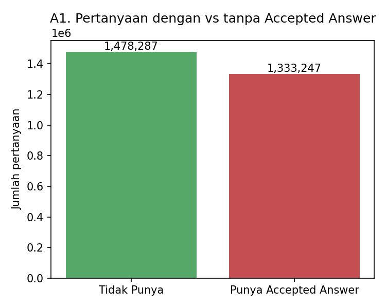

*47.4% dari 2,811,534 pertanyaan punya accepted answer.*

### A2. Rasio Match Question->Answer

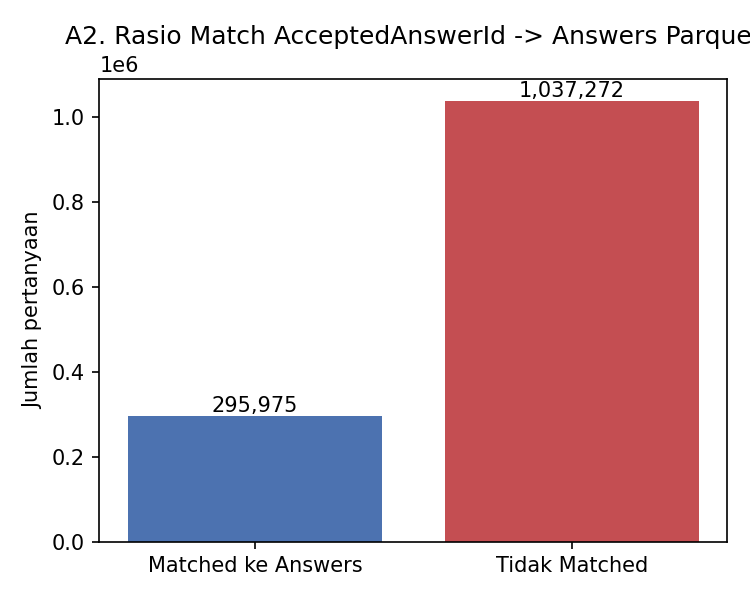

*Match rate: 22.2% (295,975 dari 1,333,247).*

### A3. Distribusi match_source

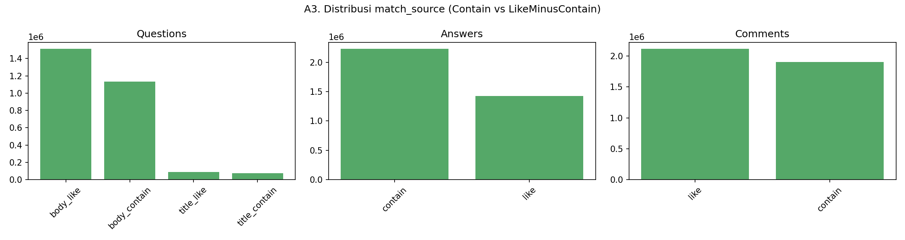

*Proporsi baris asal Contain vs LikeMinusContain per kategori file.*

### A4. Distribusi Panjang Token Pertanyaan

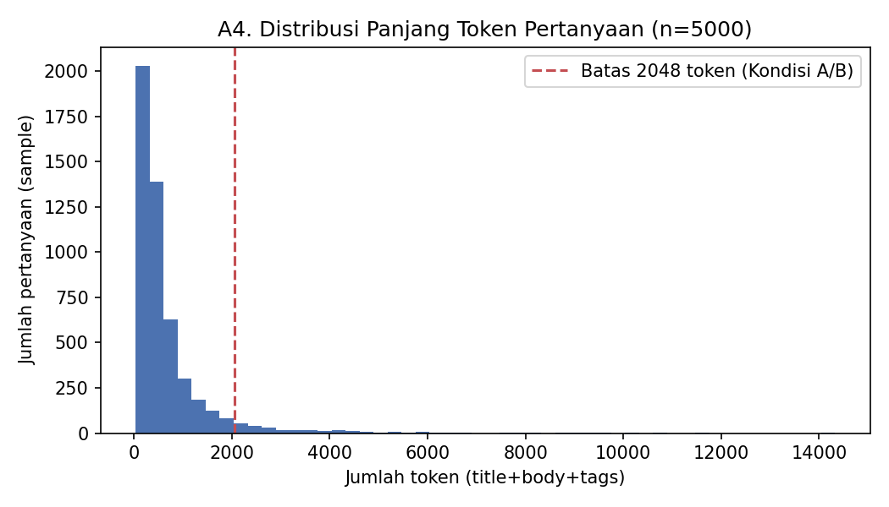

*Estimasi dari sample: ~5.2% pertanyaan akan ter-eksklusi filter 2048 token.*

## Grup B. Karakteristik Konten & Topik

### B5. Top-20 Tag

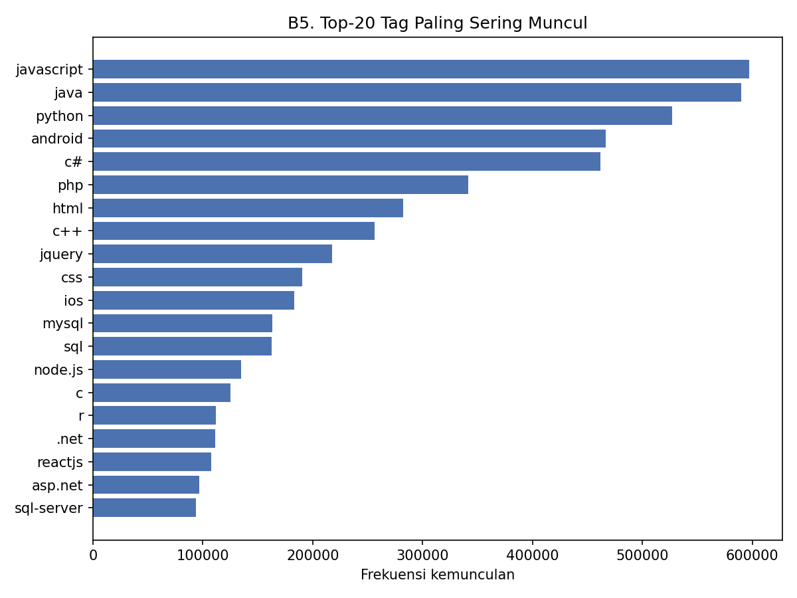

*Tag terbanyak: javascript (597,268x).*

### B6. Jumlah Tag per Pertanyaan

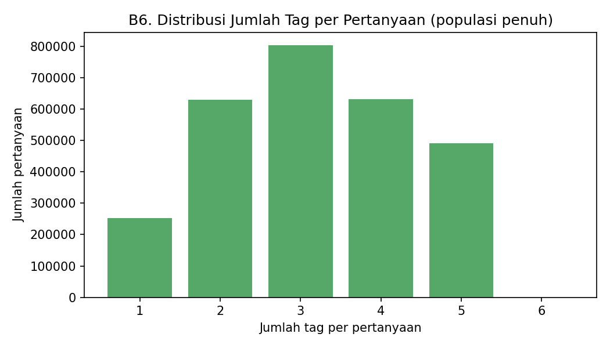

### B7. Panjang Body Q vs A

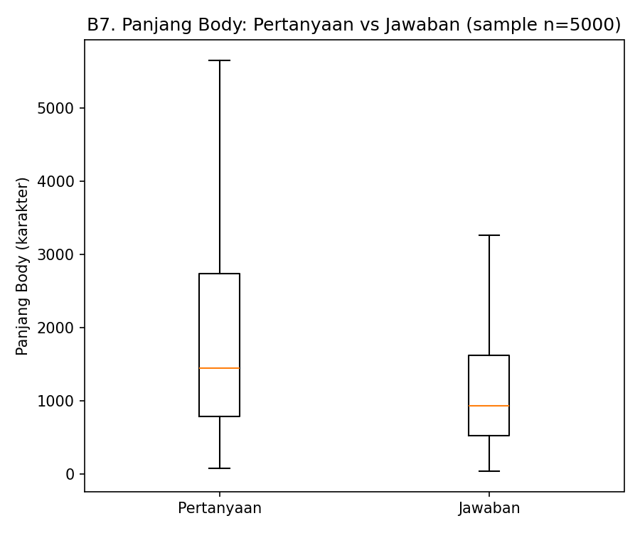

*Outlier ekstrem disembunyikan (showfliers=False) supaya skala tetap terbaca.*

## Grup C. Sinyal Kepercayaan Komunitas

### C8. Distribusi Score Q vs A

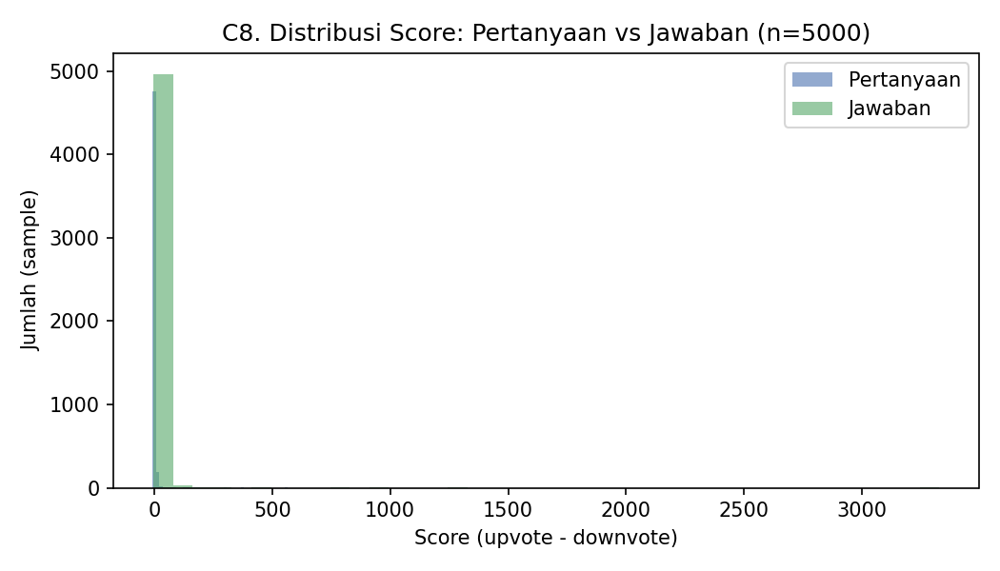

### C9. Distribusi ViewCount

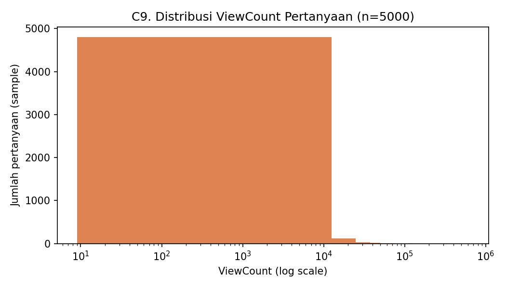

### C10. Score Accepted vs Non-Accepted

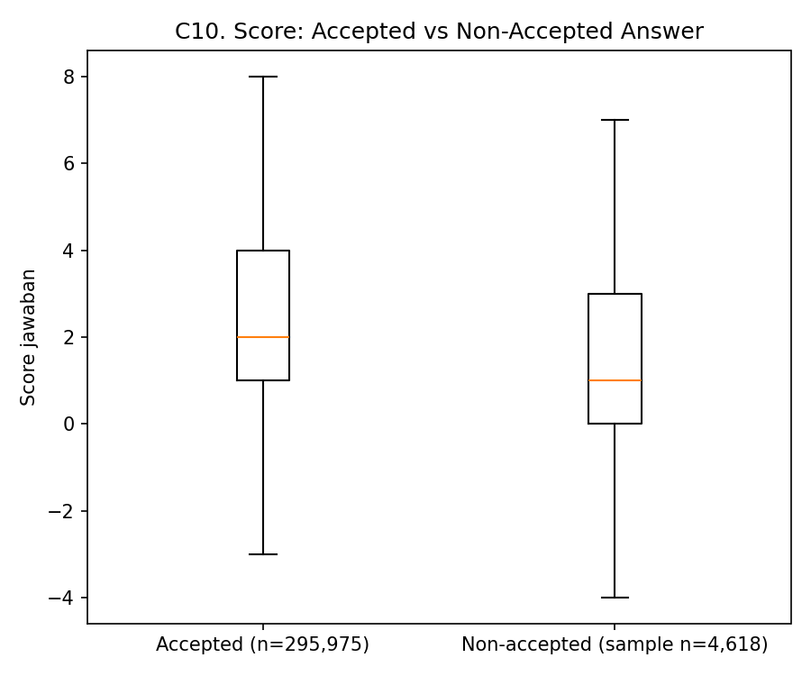

*Median accepted=2.0 vs non-accepted=1.0 -- validasi awal apakah accepted answer memang cenderung Score lebih tinggi.*

### C11. Distribusi Reputasi Kontributor

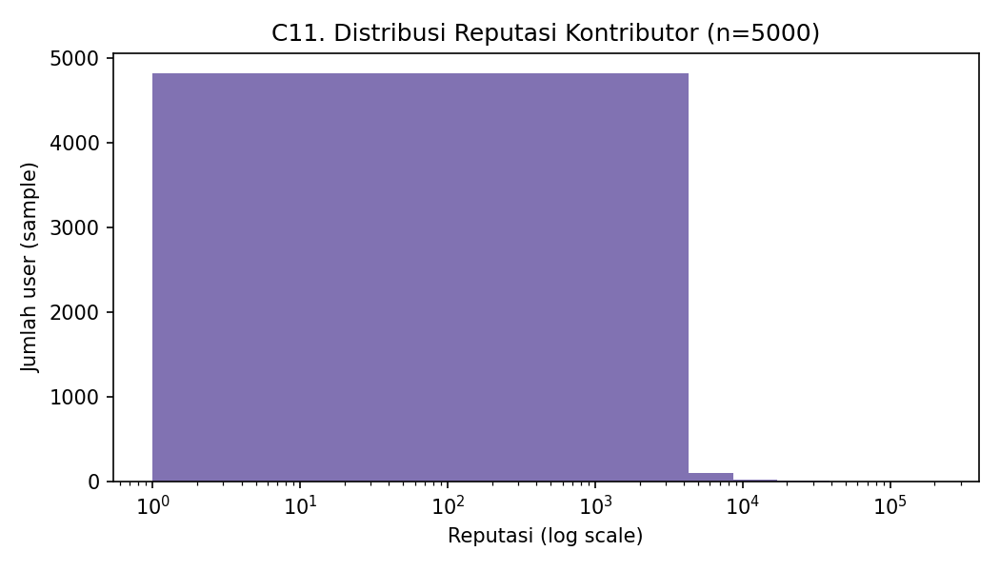

### C12. Distribusi Jenis Vote

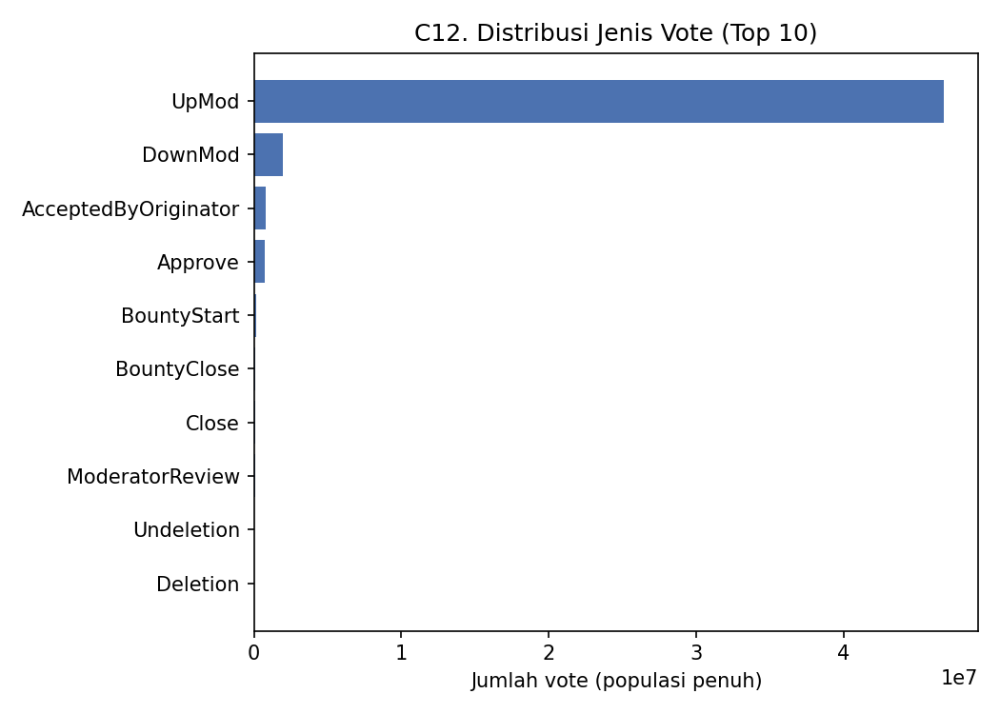

*Dihitung dari populasi penuh FilteredVotes.csv (agregasi SQL, bukan sample).*

### C13. Distribusi Badge per User

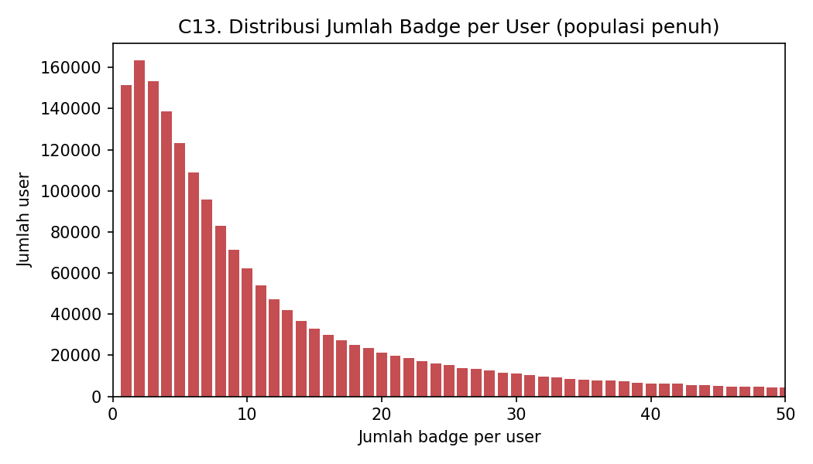

*Sumbu-x dibatasi sampai 50 badge/user supaya ekor panjang tidak mendominasi chart.*

## Grup D. Dimensi Waktu

### D14. Tren Pertanyaan per Bulan

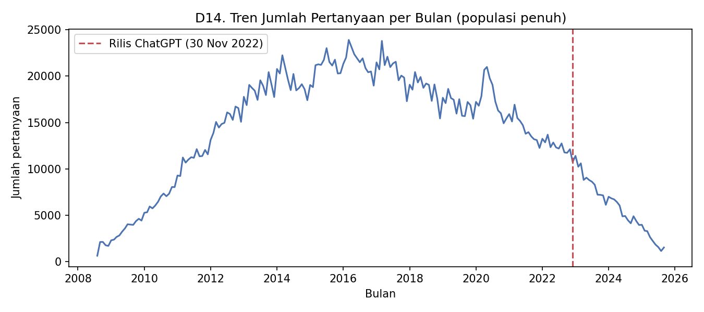

### D15. Tren Waktu Q vs A vs Comment

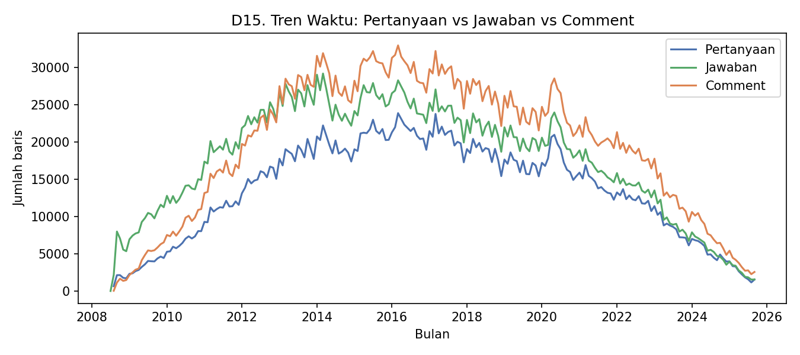

*Cek apakah data historis representatif / tidak bias ke periode tertentu.*

## Grup E. Kelayakan sebagai Basis Knowledge Graph

### E16. Jumlah Comment per Post

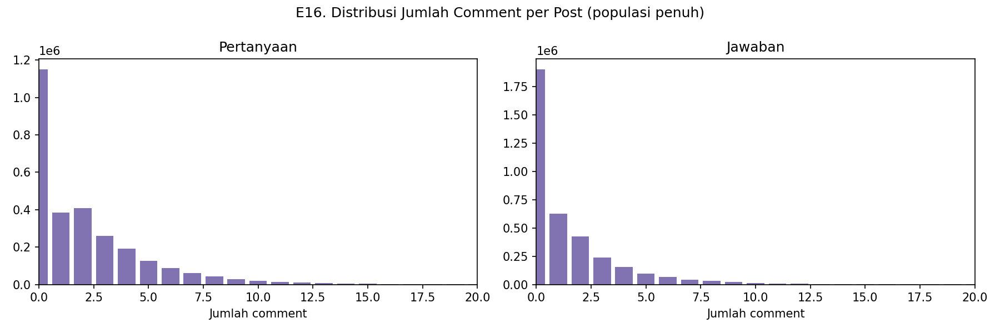

*Proxy edge density untuk relasi Comment di Knowledge Graph.*

### E17. Jumlah Jawaban per Pertanyaan

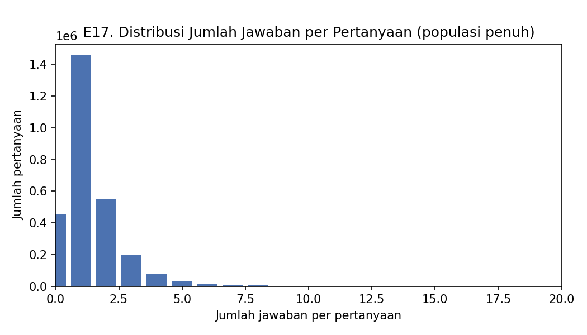

*Proxy derajat simpul (node degree) Question->Answer di KG.*

### E18. Subset Matched vs Total Populasi

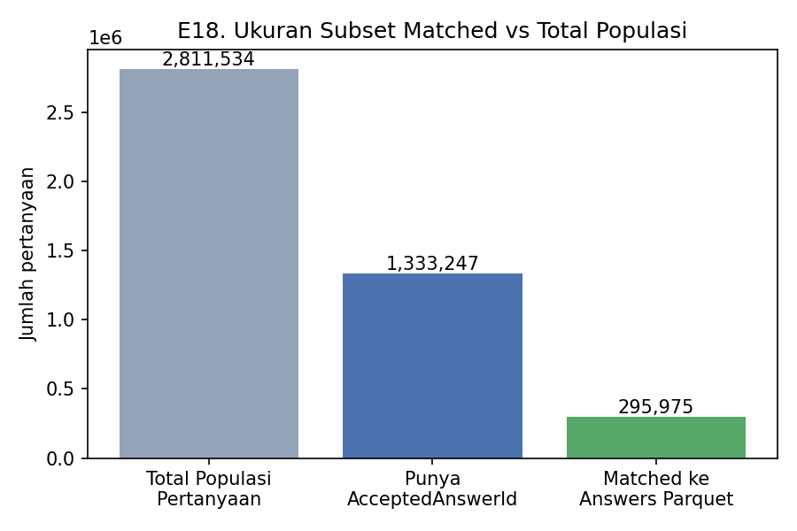

*Subset matched = 10.5% dari total populasi pertanyaan.*

### E19. Jumlah Tag Unik

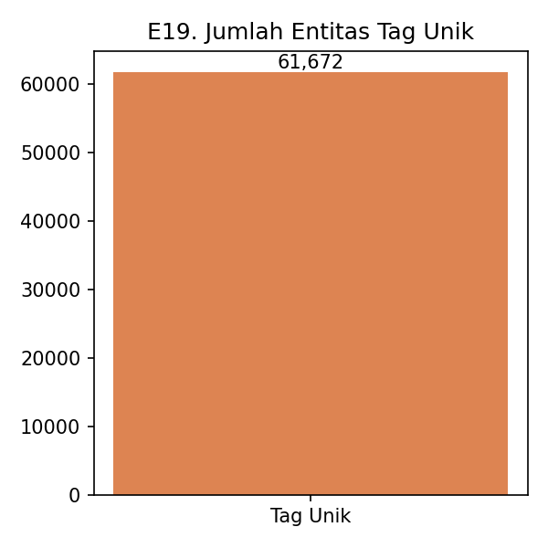

*61,672 tag unik -- estimasi kasar ukuran node kategori Tag di KG.*
